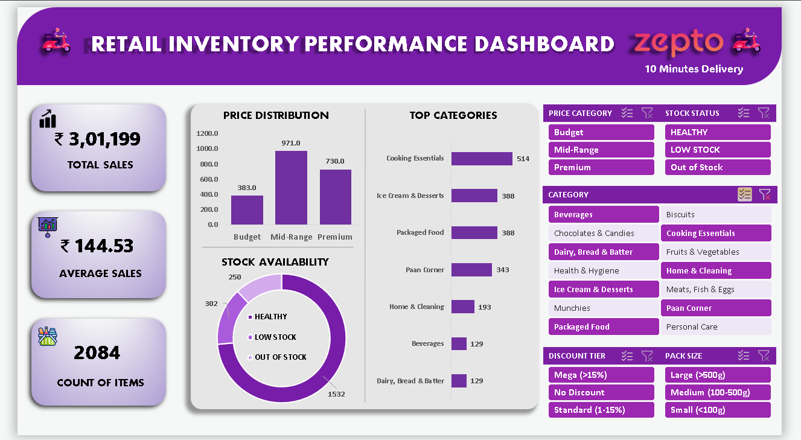

# 🛒 Zepto Retail & Inventory Performance Dashboard

  

---

### 🚀 Quick Navigation
[📊 Key Features](#-key-features) • [💡 Business Insights](#-key-business-insights) • [📥 How to Use](#-how-to-use)

---

## Project Overview
This project transforms raw retail data (3,700+ products) into a professional, interactive dashboard. The goal was to identify supply chain gaps and analyze how Zepto positions its pricing and discounts across different categories.

## 🚀 Key Features
KPI Tracking: Real-time updates for Total Revenue, Average Price, and Item Count.

Inventory Logic: Built a "Stock Status" engine to track Healthy vs. Out-of-Stock items.

Interactive Slicers: 5 interconnected filters (Category, Price Tier, Stock Status, Discount Range, and Pack Size).

Advanced Formulas: Utilized IFS, Nested IFs, and XLOOKUP for data categorization.

## 💡 Key Business Insights
High Risk: The Biscuits category has a 28% stock-out rate, suggesting a need for better supplier management.

Pricing Strategy: 60% of the inventory falls under the "Budget" category, aligning with Zepto's quick-commerce model.

Promotion Impact: High-discount items (>15%) are predominantly found in the Fruits & Vegetables sector.

## 📥 How to Use
Download the Zepto-Retail-Analysis-Dashboard.xlsx file.

Open in Microsoft Excel (Enable Macros/Content if prompted).

Use the Slicers on the left to filter the visual data.
---

## 🔍 Deep Dive into Analysis

<b>Click to expand: Data Cleaning & Transformation Logic</b>

For this project, I performed extensive data engineering to turn raw CSV data into a functional dashboard:
- **Currency Normalization:** Converted `mrp` and `sellingPrice` from paise to Rupees.
- **Dynamic Categorization:** Created a `Price_Category` logic using `IFS` to bucket products into *Budget*, *Mid-Range*, and *Premium*.
- **Stock Health Engine:** Built a logic to identify *Healthy*, *Low Stock*, and *Out of Stock* items based on inventory levels.

<b>Click to expand: Dashboard Slicer Logic</b>

The dashboard is powered by 5 interconnected slicers:
1. **Category:** Drill down into specific aisles (Munchies, Dairy, etc.)
2. **Price Tier:** Analyze based on customer spending power.
3. **Stock Status:** Critical for supply chain managers.
4. **Discount Range:** Measure the depth of markdowns.
5. **Pack Size:** Filter by single-serve vs. bulk family packs.

## 💡 Key Business Insights

| Category | Finding | Actionable Recommendation |
| :--- | :--- | :--- |
| **Biscuits** | 28% Out-of-Stock Rate | High priority for restocking; potential lost revenue. |
| **Fruits & Veg** | 15.4% Avg. Discount | Main driver for customer acquisition. |
| **Pricing** | 60% Budget Items | Strategy focused on high-frequency, low-cost purchases. |

## 🛠️ Technical Stack
- **Excel Power User:** `██████████████████▒▒ 90%`
- **Data Cleaning:** `████████████████████ 100%`
- **Dashboard UI/UX:** `████████████████▒▒▒▒ 80%`
